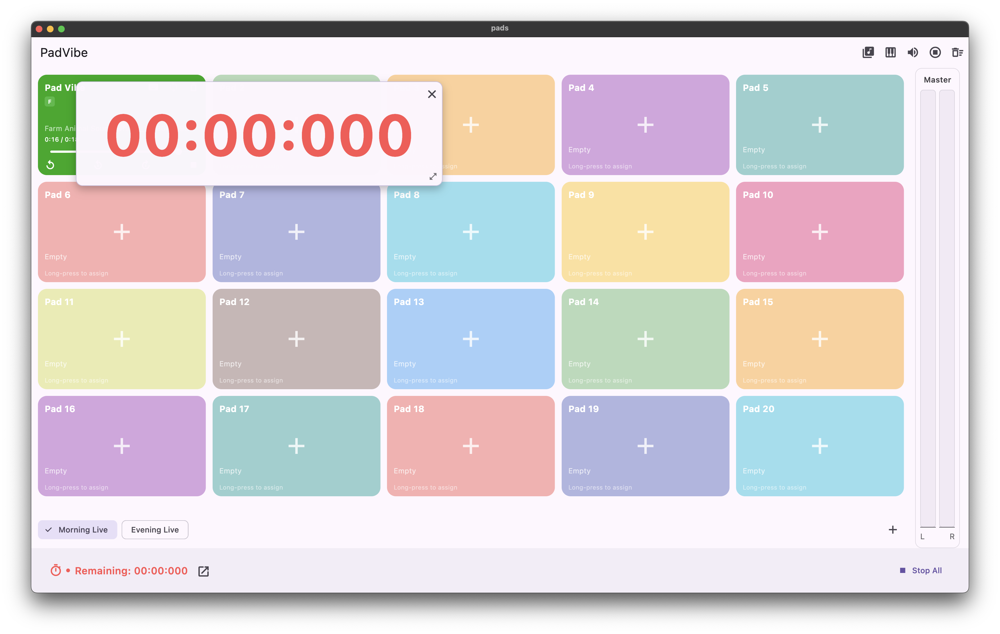
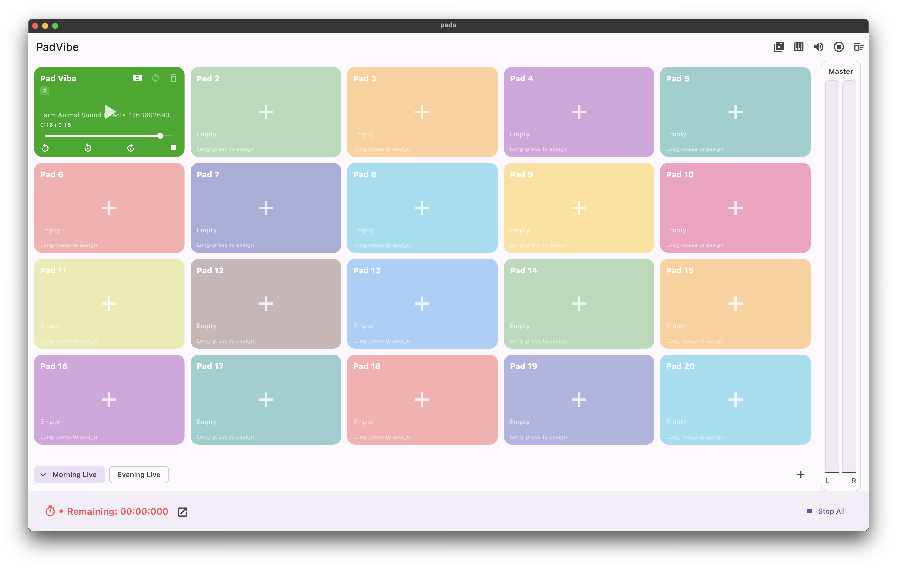
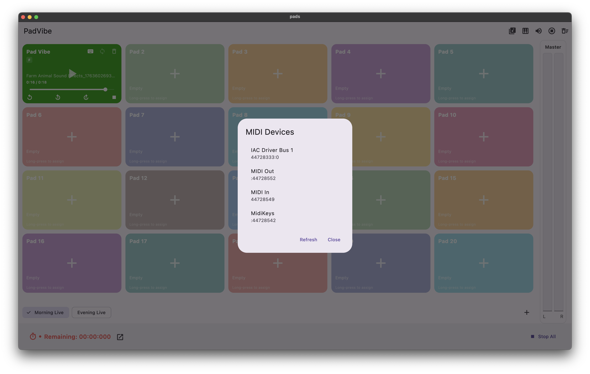

# PadVibe

[](https://flutter.dev)


Cross‑platform Flutter app built for macOS (primary) and tested on macOS; also supports Windows, Linux, and Web. Includes drag‑and‑drop, multi‑window, file picking, and SoLoud‑based audio with session management.

## Table of Contents
- [PadVibe](#padvibe)
  - [Table of Contents](#table-of-contents)
  - [Quickstart](#quickstart)
  - [Tested Environment (macOS)](#tested-environment-macos)
  - [Run](#run)
  - [Build \& Artifacts (Release)](#build--artifacts-release)
  - [Development](#development)
  - [Configuration Flags](#configuration-flags)
  - [Command‑line Arguments (Desktop)](#commandline-arguments-desktop)
  - [Project Structure (high‑level)](#project-structure-highlevel)
  - [Screenshots](#screenshots)
  - [Release \& Versioning](#release--versioning)
  - [Web Notes (base href)](#web-notes-base-href)
  - [Troubleshooting](#troubleshooting)
  - [Contributing](#contributing)
  - [License](#license)
  - [Features](#features)
  - [Tech Stack](#tech-stack)

## Quickstart
```bash
git clone <your-repo-url>
cd padvibe
flutter pub get
```

## Tested Environment (macOS)
- macOS 14+ (Apple Silicon)
- Xcode 15+
- CocoaPods 1.14+
- Flutter (stable), Dart >= 3.9
- macOS SDK 15.0 toolchain compatible

## Run
Primary target: macOS
- macOS: `flutter run -d macos`
- Windows: `flutter run -d windows`
- Linux: `flutter run -d linux`
- Web: `flutter run -d chrome`

## Build & Artifacts (Release)
- macOS: `flutter build macos --release` → `build/macos/Build/Products/Release`
- Windows: `flutter build windows --release` → `build/windows/x64/runner/Release`
- Linux: `flutter build linux --release` → `build/linux/x64/release/bundle`
- Web: `flutter build web --release` → `build/web`

## Development
- Format: `dart format .`
- Analyze: `flutter analyze`
- Test: `flutter test`  # add tests under `test/` to enable
- Upgrade deps: `flutter pub upgrade --major-versions`

## Configuration Flags
Inject compile‑time values:
```bash
flutter run --dart-define=APP_ENV=dev
flutter build <platform> --dart-define=LOG_LEVEL=debug
```
Read in Dart:
```dart
const appEnv = String.fromEnvironment('APP_ENV', defaultValue: 'prod');
```

## Command‑line Arguments (Desktop)
Desktop runners forward CLI args to the Dart entrypoint.
```dart
// lib/main.dart
import 'dart:io';

void main() {
  final args = Platform.executableArguments;
  // parse args as needed, e.g., --file=/path/to/sample.wav --verbose
  // runApp(App());
}
```
Example:
- Windows/Linux/macOS: `padvibe --file=/path/to/sample.wav --verbose`

## Project Structure (high‑level)
- `lib/` — app source (Dart)
- `windows/`, `linux/`, `macos/` — native runners (CMake/Xcode) and glue
- `web/` — web bootstrap
- `pubspec.yaml` — dependencies and assets
- `README.md` — this file

Notes:
- Linux app ID: `com.pro26.pads` (linux/CMakeLists.txt)
- Windows runner: 1280×720 window, COM initialized, forwards args
- macOS: Pods managed by CocoaPods (auto‑generated)

## Screenshots
Place screenshots under `assets/screenshots/` and reference here.
```




```

## Release & Versioning
- Version: set in `pubspec.yaml` (`version: x.y.z+build`)
- Tag releases: `git tag vX.Y.Z && git push --tags`
- Changelog: document notable changes per release

## Web Notes (base href)
For non‑root hosting, pass `--base-href` at build time. `web/index.html` contains a placeholder:
- Example: `flutter build web --release --base-href /padvibe/`

## Troubleshooting
- Missing desktop toolchains:
  - Windows: install “Desktop development with C++” in Visual Studio
  - Linux: `sudo apt-get install build-essential cmake ninja-build pkg-config libgtk-3-dev`
  - macOS: `xcode-select --install` and `sudo gem install cocoapods`
- CocoaPods (macOS): `cd macos && pod repo update && pod install`
- Stale builds: `flutter clean && flutter pub get`
- CMake/Ninja issues: ensure minimum versions installed
- Web CORS/serving: use `flutter run -d chrome` or a static file server for `build/web`

## Contributing
- Follow `flutter_lints`
- Prefer small PRs and clear commit messages (Conventional Commits recommended)
- Keep README and docs updated when changing behavior

## License
TBD. Add a LICENSE file to clarify usage and distribution.

## Features
- Desktop and Web targets: Windows, Linux (GTK), macOS, Web
- Drag & drop files (desktop_drop)
- Native file picking (file_picker)
- MIDI Support (flutter_midi_command)
- Audio Output Selection
<!-- - Multi‑window utilities (desktop_multi_window) -->
- Audio playback via SoLoud (flutter_soloud)
- Audio session integration (audio_session)
- Fast routing/state utils (get)
<!-- - Segment‑style UI elements (segment_display) -->

## Tech Stack
- Flutter + Dart (Dart >= 3.9)
- Packages:
  - get — https://pub.dev/packages/get
  - flutter_soloud — https://pub.dev/packages/flutter_soloud
  - file_picker — https://pub.dev/packages/file_picker
  - desktop_drop — https://pub.dev/packages/desktop_drop
  - audio_session — https://pub.dev/packages/audio_session
