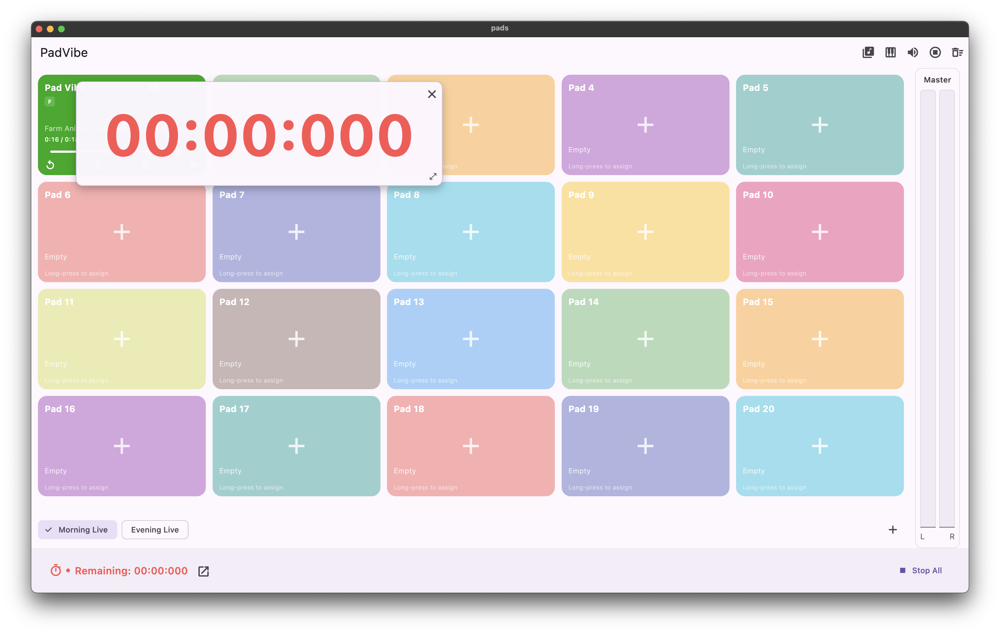
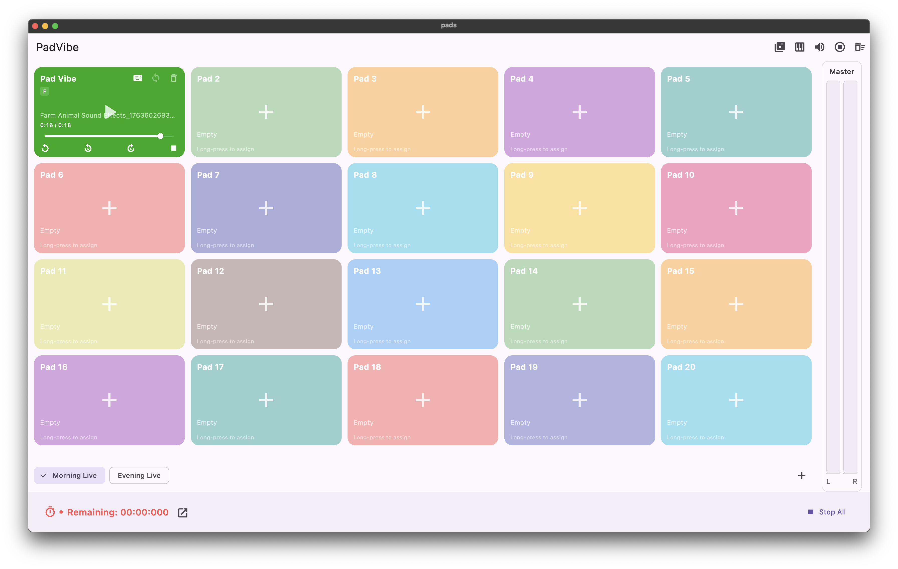

# PadVibe 🎚️

[](https://flutter.dev)
[](https://www.python.org/)
[](https://flutter.dev/desktop)
[](LICENSE)

**PadVibe** is a professional-grade, cross-platform audio sample triggering application. It combines the expressive UI capabilities of **Flutter** with a high-performance **Python Sidecar** audio engine to deliver low-latency playback, advanced routing, and real-time DSP.

---

## 🏗️ Architecture: The Sidecar Pattern

PadVibe employs a unique **Dual-Engine Architecture**. While Flutter handles the complex UI and state management, a dedicated Python process (the "Sidecar") manages the heavy lifting of audio and MIDI.

### 🔌 Communication Flow
1.  **Flutter (Client):** Sends JSON commands via **WebSockets** (Port 8765).
2.  **Python Sidecar (Server):** Executes audio playback, DSP, and MIDI polling.
3.  **Real-time Feedback:** The Sidecar streams 20FPS audio levels (RMS/Peak) and MIDI events back to Flutter for immediate UI updates.

---

## ✨ Key Features

### 🎧 Pro Audio Engine
- **Multi-Device Routing:** Assign individual pads to specific hardware output channels or different audio interfaces entirely.
- **Dynamic DSP:** Real-time Low-pass and High-pass filters for every pad.
- **Soft Limiter:** Integrated `tanh` soft-knee limiting on the master bus to prevent digital clipping.
- **Waveform Visualization:** High-fidelity waveform generation for every sample.
- **Professional Metering:** L/R channel independent RMS and Peak meters with ballistics and peak-hold.

### 🎹 MIDI & Control
- **MIDI Learn:** Map any pad to any MIDI note on your external controllers.
- **Keyboard Shortcuts:** Global and local hotkeys for instant triggering.
- **Local API:** Built-in HTTP server (Port 9696) and Webhooks allow external software to monitor and control PadVibe's state.

### 🖥️ UX & Workflow
- **Tabbed Layouts:** Organize your performance into multiple groups/banks.
- **Drag & Drop:** Instant sample loading by dropping files onto pads.
- **Multi-Window:** Detachable timer overlay for performance tracking.
- **Smart Storage:** Automatically imports and manages audio files in a local library.

---

## 📂 Project Structure

```text
padvibe/
├── lib/                        # Flutter Application
│   ├── app/
│   │   ├── data/               # Models (Pad, PadGroup)
│   │   ├── modules/            # UI Modules (Home, Splash, Timer)
│   │   ├── routes/             # GetX Routing
│   │   └── service/            # Core Services
│   │       ├── audio_engine_service.dart   # WS Communication
│   │       ├── audio_player_service.dart   # High-level Logic
│   │       ├── midi_interface_service.dart # MIDI Logic
│   │       └── sidecar_service.dart        # Process Management
│   └── main.dart               # Entry point
├── sidecar/                    # Python Audio/MIDI Engine
│   ├── audio_engine.py         # sounddevice/numpy DSP & Playback
│   ├── midi_engine.py          # mido MIDI Listener
│   ├── midi_server.py          # WebSocket Server
│   └── build_sidecar.sh        # PyInstaller Build Script
├── assets/                     # UI Assets & Screenshots
└── native_lib/                 # Native C++ bridges (if any)
```

---

## 🚀 Getting Started

### Prerequisites
- **Flutter SDK:** 3.x
- **Python:** 3.9+ with `pip`
- **Native Tools:** 
  - macOS: `xcode-select --install`
  - Linux: `libgtk-3-dev`, `libasound2-dev`, `libjack-dev`

### Installation
1.  **Clone the repo:**
    ```bash
    git clone https://github.com/shabeer-wms/padvibe.git
    cd padvibe
    ```
2.  **Install Python dependencies:**
    ```bash
    pip install -r sidecar/requirements.txt
    ```
3.  **Get Flutter packages:**
    ```bash
    flutter pub get
    ```
4.  **Run (Development):**
    ```bash
    flutter run
    ```

> **Note:** On the first run, the app will attempt to start the Python sidecar using `python3 sidecar/midi_server.py`. For production, the sidecar should be built using `sidecar/build_sidecar.sh`.

---

## 🛠️ Tech Stack

| Component | Technology |
| :--- | :--- |
| **Frontend** | Flutter, GetX (State), Desktop Multi-Window |
| **Backend** | Python 3, Websockets (asyncio) |
| **Audio** | sounddevice, soundfile, NumPy (DSP) |
| **MIDI** | mido, python-rtmidi |
| **Storage** | path_provider, JSON-based persistence |

---

## 📸 Screenshots


*Professional Pad Grid with Real-time Waveforms*


*High-precision L/R Metering and Master Fader*

---

## 🤝 Contributing
Contributions are welcome! Please read our contributing guidelines and ensure you follow the established code style for both Dart and Python.

## 📄 License
TBD - See LICENSE file for details.